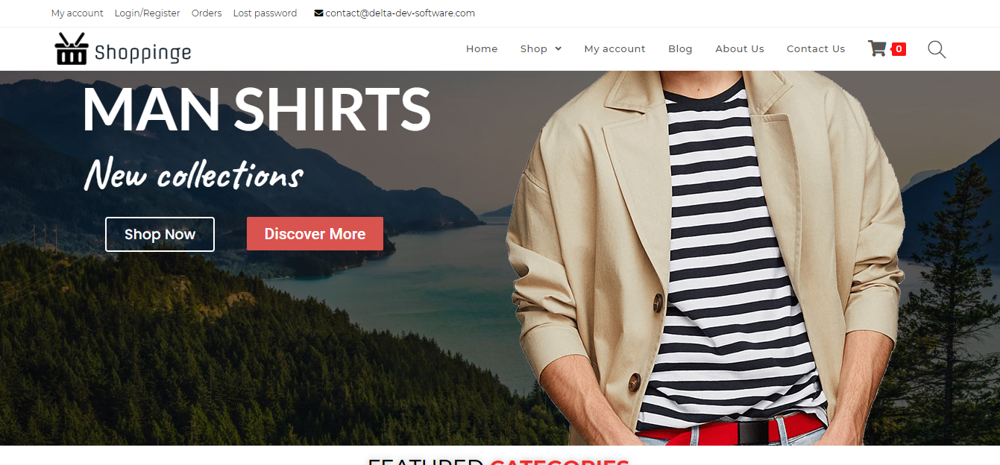

	

## Introduction

Shoppinge is eCommerce website that allows consumers to directly buy goods or services from a seller over the Internet
using a web browser or a mobile app.

## Informations

- Status: Finished
- Lastest version: 1.0
- Sector: Ecommerce
- Created: December 2020
- Last updated: December 2020

## Table of contents
* [Documentation](#general-info)
* [Demo](#demo)
* [Screenshots](#screenshots)
* [Technologies](#technologies)
* [Setup](#setup)
* [Features](#features)
* [Status](#status)
* [Contact](#contact)
* [License](#license)

## Documentation
Please read the [documentation](https://github.com/aniskchaou/SMARTLAB-FRONTEND-CLIENT/wiki) page for more details.

## Demo
[demo shoppinge ](http://shoppinge.byethost10.com/)

## Screenshots

	

## Technologies
* Wordpress
* woocommerce

## Setup

## Features
- Manage the cart

## Status
Project is: _ finished _

## Contact
contact@delta-dev-software.com

## License
<a href="license.txt">MIT License</a>